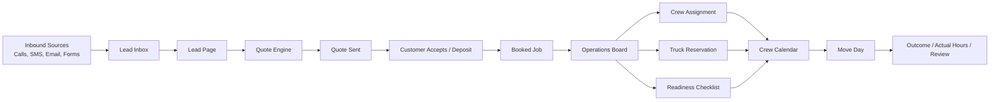
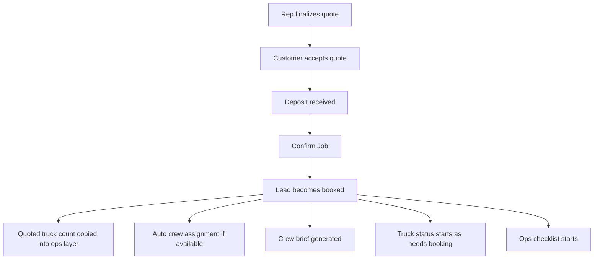

# Mission Control Team Handbook

Date: 2026-04-30

> Superseded for current CRM training by `docs/saturn-star-crm-operating-playbook.md`. Keep this document only as historical operations context.

Visual map:
- Browser version: `/SOPs/mission-control-map.html`

## Purpose

This document explains how Saturn Star's Mission Control system is supposed to be used by:

- sales reps
- managers
- operations leads
- crew

It is based on the current live workflow in the codebase as of April 30, 2026.

## Core Rule

The quote is the commercial promise to the customer.

That means:

- quoted price comes from the quote
- quoted crew size comes from the quote
- quoted truck count comes from the quote
- operations should reserve against that quote, not invent a different truck count later

If the customer was quoted `1 truck`, operations should reserve `1 truck`.
If the customer was quoted `2 trucks`, operations should reserve `2 trucks`.

Operations can add reservation details, but they should not silently change what was sold.

## What Each Record Means

### Lead

The lead is the working customer file.

It holds:

- customer identity
- move addresses and timing
- inbox activity
- call logs
- SMS and email context
- notes
- stage
- ops execution details after booking

### Quote

The quote is the pricing and service promise.

It holds:

- move date
- route
- crew size
- estimated hours
- truck count
- price
- deposit
- acceptance status

### Booked Job

A booked job is still stored on the lead, but once booked it also becomes an operations record.

It holds:

- assigned crew
- crew notes
- truck reservation status
- truck pickup and return details
- reservation number
- readiness checklist
- crew hours

### Job Outcome

The outcome record is the after-the-job actuals layer.

It holds:

- actual hours
- actual crew count
- costs and margin
- notes
- review and referral markers

## Role Access

### Owner

- full access
- sees sales, operations, finance, team, and admin tools

### Manager

- sees sales and operations
- can reassign work
- can manage crew assignment
- can review booked jobs and actuals

### Sales Rep

- works leads, inbox, pipeline, quotes, calls, SMS, and email
- does not run the operations board

### Operations Lead

- works the operations board
- assigns crew
- updates dispatch and truck reservation details
- updates readiness checklist
- logs crew hours

### Crew

- sees only assigned jobs on the crew calendar
- uses the job route, move details, and crew note

## Sales Workflow

### 1. New activity comes in

Inbound activity can come from:

- calls
- SMS
- email
- website forms

That activity lands in the CRM and becomes a lead or updates an existing lead.

### 2. Rep triages in Inbox or Pipeline

Primary sales workspaces:

- `/sales/inbox`
- `/sales/pipeline`
- `/sales/leads/[id]`

Inbox is best for:

- fresh inbound activity
- missed calls
- unread communication

Pipeline is best for:

- stage management
- follow-up prioritization
- owned workload

### 3. Rep works the lead page

The lead page is the working file.

Reps should use it to:

- confirm customer details
- confirm route
- confirm move date
- capture inventory
- capture access and parking notes
- log calls and notes
- continue SMS and email conversations

### 4. Rep creates the quote

Quote creation uses the lead data and pricing engine.

The quote should reflect:

- route
- inventory scope
- crew size
- estimated hours
- truck count
- price and deposit

### 5. Rep sends quote and closes

After sending:

- customer can view and accept
- deposit can be collected
- quote status updates the sales flow

### 6. Booking creates the ops handoff

When the job is confirmed:

- lead stage becomes `booked`
- branch is assigned
- deposit status is stored
- auto crew assignment can happen
- crew brief is generated
- truck reservation status is initialized
- ops checklist is initialized

## Operations Workflow

### 1. Operations board starts at booked jobs

Primary operations workspace:

- `/sales/operations`

Ops should use this page to review:

- move date
- branch
- route
- quoted crew size
- quoted truck count
- estimated hours
- deposit status

### 2. Ops setup happens from the booked job

Dispatch setup should cover:

- crew assignment
- crew note
- truck vendor
- truck reservation status
- pickup location
- pickup time
- return location
- reservation number
- reservation notes
- readiness checklist
- crew hours

### 3. Truck reservation is manual-first today

Current live state:

- Mission Control stores truck reservation details
- Mission Control does not auto-book U-Haul yet

So the current ops flow is:

1. open the booked job
2. look at the quote-derived truck count
3. reserve the truck manually with the vendor
4. store the reservation details back in Mission Control

### 4. Crew sees assigned work

Crew workspace:

- `/crew/calendar`

Crew should use it to see:

- move date
- route
- key items
- crew note
- truck count
- estimated hours
- contact phone

### 5. After the move, actuals are recorded

Post-job workflow:

- record actual hours
- record actual crew count
- store overage note when needed
- keep crew hours for payroll-style tracking

## Non-Negotiable Team Rules

### Sales rules

- Do not send a quote until route and move scope are reasonably correct.
- Do not promise a truck count verbally that differs from the quote.
- Once a quote is accepted or booked, do not revise locked commercial fields casually.

### Operations rules

- Treat the quote as the source of truth for truck count.
- Use Mission Control to store reservation details immediately after booking.
- Do not leave booked jobs without a truck status.
- Do not leave booked jobs without crew assignment close to move day.

### Manager rules

- Check the operations board daily for `needs booking` and `issue` truck statuses.
- Check jobs with incomplete readiness checklists.
- Check for jobs where truck count exists on the quote but no reservation details exist yet.

## Current System Limits

These are important so the team understands what is live and what is not.

- Truck reservation tracking is live.
- Automatic rental-vendor booking is not live yet.
- Crew hours are stored on the booked job now.
- Full payroll automation is not live yet.
- Ops can update dispatch fields directly.
- Ops should not use the dispatch panel to rewrite the customer promise.

## System Map

## Sales-to-Ops Handoff

## Truck Source of Truth

